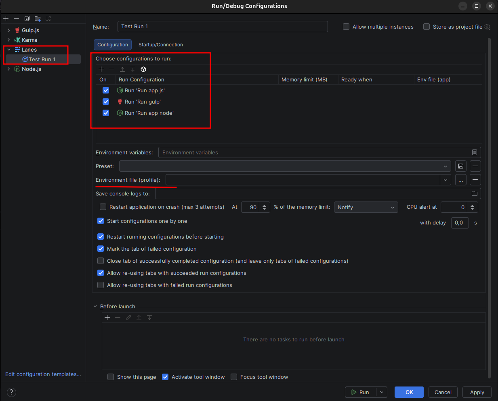

**Thank you so much for your support! 🎉**

This project is built and maintained with dedication in my own time. Your contribution helps
cover maintenance costs and allows me to continue creating free tools, improving existing ones,
and building new projects for the community.

Every contribution, no matter the size, makes a real difference. Thank you for being part of
this journey! ❤️

[](https://buymeacoffee.com/welingtonmonteiro)

> **Group, launch and control multiple Run Configurations from a single click — with the
> environment, ordering and monitoring that a real multi-service workflow needs.**
>
> Lanes turns IntelliJ IDEA, WebStorm and every other JetBrains IDE into a lightweight
> orchestrator for the services, tests and tools you run together every day.

Fork of the original [Multirun](https://github.com/rkhmelyuk/multirun) plugin by Ruslan Khmeliuk.



IntelliJ ships with a built-in [Compound run/debug configuration](https://www.jetbrains.com/help/idea/run-debug-configuration-compound.html),
but if you need more flexibility and control over *how* the configurations are executed
(order, delay, tab handling, marking failures, etc.) then Lanes is for you.

You create a **Lanes** run configuration, add the run configurations you want to it, pick a
few options, and run everything at once — as a group, in parallel or one-by-one.

## ✨ Features

### 📦 Grouping
- Group any number of run configurations into a single **Lanes** configuration and start
  them with one click.
- **Nesting / composite configurations**: a Lanes configuration can contain other Multiple
  Run configurations, so you can build a "master" configuration that starts several groups at once.
- **Loop protection**: the editor and runner detect and prevent cycles (A contains B, B contains
  A), so you can nest freely without breaking anything.

### ▶️ Execution modes
- **Parallel** — start all configurations at the same time.
- **One by one** — start the next configuration only after the previous one has started. This is
  useful when "Before launch" tasks would otherwise run in parallel and interfere with each other.
- **Enable/disable per application** — every row of the configurations list has an *On* checkbox;
  unchecked applications stay in the list (keeping their memory limit and other settings) but are
  not launched. Handy to temporarily skip a service.
- **Ready when (docker-compose style `depends_on`)** — with *one by one*, fill the *Ready when*
  column of an application and the next one only starts when it is actually ready:

  | Syntax | Meaning |
  |--------|---------|
  | `port:3003` | a TCP port on localhost accepts connections |
  | `http://localhost:3003/health` | an HTTP GET answers 2xx/3xx |
  | `log:Server started` | the console output contains the text (plain text works too) |

  The wait is capped at 2 minutes — after that the chain continues anyway. Port/http conditions
  also feed the *Status* column of the Lanes Monitor (healthy/down, re-checked every
  refresh, like `docker ps`).

### ⏱️ Delay between configurations (one-by-one mode only)
The delay field accepts fractional seconds (e.g. `0.5`) and behaves as follows:

| Delay value | Behavior |
|------------|----------|
| `0`        | Start the next configuration immediately after the previous one has started. |
| positive (e.g. `2.0`) | Wait up to N seconds before starting the next one (starts earlier if the current process finishes first). A progress bar shows the countdown. |
| negative (e.g. `-1`)  | **Serial execution** — wait until the current process *completes* before starting the next one. |

The delay field is only enabled when *Start configurations one by one* is checked, and the value
is parsed using the current locale (so `0,5` works on locales that use a comma as the decimal separator).

### 🌱 Environment variables override
- Define environment variables directly on the Lanes configuration — they are applied to
  **every** configuration in the list, overriding the child's own variables with the same name.
- Uses the standard IDE dialog (add variables one by one, paste, and toggle
  *Include system environment variables*).
- Overrides propagate through nested Lanes configurations too.
- **Environment file with profiles**: the *Environment file* field is an editable dropdown.
  Point it to a `.env` file (browse button or type the path — relative paths are resolved against
  the project root) and the file becomes a **profile** that stays in the dropdown; switch between
  environments (`.env.development` / `.env.staging` / `.env.production`, …) by just picking another
  profile — no retyping. The browse button takes **several `.env` files at once** (Ctrl/Shift-select),
  adding them all to the dropdown in one go. The ✕ button removes the selected profile from the list.
  The file uses the usual dotenv format: `KEY=VALUE` lines, `#` comments, optional `export` prefix and
  quoted values. It is re-read on every run, so editing the file requires no configuration changes.
  Variables from the table above win over the file on conflicts. The **Lanes Monitor** shows the
  active profile of each running application in its *Env* column — and, when the group has more than one
  profile, lets you **switch the whole group's environment from there** (see below).
- Works with configuration types that expose environment variables (Node.js, npm, Java
  Application, etc.); other types run unchanged.
- **Per-application env file**: the applications table has an **Env file (app)** column — point an
  app at its own `.env` file and it **overrides the group's environment** (both the variables and
  the group env file) for that app only. Empty = use the group's environment. Re-read on every run;
  relative paths resolve against the project root.

### 🎛️ Execution presets
- Save the current **On/Off** selection of applications plus the active **environment profile** as
  a named **preset**, then flip between scenarios from the **Preset** dropdown in the editor —
  "backend only", "full stack", "everything but the workers", … — without re-checking boxes.
- **Save** captures the current selection under a name you type; **✕** deletes the selected preset;
  picking a preset applies its enabled apps and its profile to the list. Presets are stored in the
  run configuration, so they travel with it.

### 🐳 Import from docker-compose.yml
- The list toolbar has an **Import from docker-compose.yml…** button that reads a compose file and
  applies it to the run configurations **already in the list** whose name matches a service:
  - `mem_limit` (and the Swarm-style `deploy.resources.limits.memory`) → the **Memory limit** column;
  - `env_file` → an **environment profile** (added to the dropdown; set as active when unambiguous);
  - `depends_on` → the list is **reordered** so dependencies start first, and a `port:<published>`
    **Ready when** gate is added to services that publish a port (one-by-one mode is enabled).
- It never creates run configurations: services with no matching configuration are listed in a
  report and skipped. Add configurations with matching names and import again.

### 🧠 Per-application memory limit
- The configurations list is a table with an editable **Memory limit (MB)** column — click the
  cell next to an application and type the cap (empty = no limit). The process-level analog of
  Docker's `mem_limit`.
- Applied at launch through the environment: `NODE_OPTIONS --max-old-space-size=<MB>` (Node.js)
  and `JAVA_TOOL_OPTIONS -Xmx<MB>m` (JVM); existing options in those variables are preserved.
- Note: unlike Docker, a plain OS process has no enforced swap/reservation limits — this caps the
  runtime heap, which is what usually matters for Node/JVM apps in development.

### 📊 Process monitor (docker-stats style)
- The **Lanes Monitor** tool window (bottom stripe of the IDE, or `Run → Lanes
  Monitor`) shows a live table with **every process the IDE is running** — apps started by
  Lanes *and* standalone (singleton) runs:

  | Name | Lanes | Env | PID | Ports | Uptime | Status | Mem Usage / Limit | Mem % | Mem trend | CPU % |
  |------|--------------|-----|-----|-------|--------|--------|-------------------|-------|-----------|-------|

- The **Name** column shows the origin of each app: the Lanes icon for apps launched by a
  group, or the run configuration's own icon (node, npm, jest, …) for standalone runs. An app
  restarted individually from the monitor stays in the list and keeps showing its group, env
  profile and memory limit.
- **Env** shows the active environment profile — **click it** to open a viewer with the
  environment variables Lanes actually loaded for that app at launch (group variables, group
  env file, memory-limit options and per-app env file, merged). The viewer has a **filter by
  variable name** at the top and a **Mask values** toggle for screen sharing.
- **Status** shows **running** (green) for every live application, refining to **healthy**/**down**
  for applications with a port/http *Ready when* condition. **Double click** a row to jump to the
  console tab of that application. **Columns are resizable** — drag the header edges.

- Works like `docker stats`: memory usage is shown against the configured *Memory limit (MB)* of
  the application (or against the total machine memory when no limit is set), so you can check at
  a glance whether an app is close to its cap.
- **Ports** lists the TCP ports each application is listening on (like the PORTS column of
  `docker ps`), so you always know who owns a port. Ports are **clickable** — click one to open
  `http://localhost:<port>` in the browser (a menu lets you pick when there are several). **Uptime**
  shows how long the app has been running.
- **CPU %** is instantaneous, computed from the CPU-time delta between two consecutive samples —
  the same method docker stats uses (it can exceed 100% on multi-core machines). The first refresh
  shows `n/a` while the baseline is collected.
- Each application is measured as a **whole process tree** (e.g. the `npm` wrapper plus the actual
  `node` child processes), refreshed automatically every 2 seconds. Rows disappear when the
  process terminates.
- **Restart per row** (toolbar or right-click) — stops and starts again *only* the selected
  application; the rest of the group keeps running untouched.
- **Batch actions** — select several rows (Ctrl/Shift-click) and *Restart*, *Stop* or *Force Kill*
  act on all of them at once; the selection survives the automatic refresh, so the action always
  targets every app you picked. **Restart Unhealthy** (toolbar) restarts every app whose `port:`/`http`
  readiness check is currently down.
- **Restart All** (toolbar) — a badge shows the number of running applications; one click relaunches
  the whole set (sits next to **Stop All**).
- **Switch environment** — when a group has more than one env profile, the *Env* cell becomes a
  dropdown (`▾`): pick another profile to switch **just that application** (a per-app override) and
  restart only it — the rest of the group keeps running (a *view loaded variables* entry still opens
  the read-only viewer). The **Switch Environment** toolbar button (badge = running apps) does it in
  bulk: choose one environment in a modal and it is applied to **every running app at once**,
  restarting them — no need to change them one by one. Both keep each app's **executor** (Debug comes
  back as Debug), relaunching the app through the group so it stays tracked and shows the new
  environment; the chosen profile is saved on the run configuration.
- **Stop / Force Kill per row** (toolbar or right-click): *Stop* asks the application to terminate
  (same as the stop button of its run tab); *Force Kill* sends SIGKILL to the whole process tree
  of the selected application, after confirmation — for processes that refuse to die.
- **Kill Process on Port…** — type a TCP port and the plugin finds whatever process is listening
  on it (even one not started by Lanes), shows PID + command for confirmation and kills it.
  The quickest cure for `EADDRINUSE: address already in use`.
- **Mem trend** — a sparkline with the memory history of the last minute per application; the
  shape shows growth/leaks at a glance and the color tracks how close the app is to its limit
  (green → orange at 70% → red at 90%). **Click it** to open a full-session memory chart for that
  app:
  - **Chart** tab — RSS over time with **labeled axes** (X = elapsed time, Y = memory), grid lines
    and tick labels, plus an **Export CSV** button (timestamp, RSS, percent).
  - **Analysis** tab — a memory-trend / possible **leak verdict** (growing / stable / shrinking).
    A *growing* trend that is steady (high R²) is flagged as a **likely leak**. Shows the growth
    rate in MiB/min, the projected growth per hour, the R² of the trend, how often memory was never
    freed, and the first→last / min→peak figures. Below it, a **per-process breakdown** of the
    application's process tree (PID, command, memory, % of tree) — heaviest first — with a **filter**
    (by PID or command) and an **Export analysis…** button that saves the verdict + breakdown as a
    text report.
- **Memory Analysis** (toolbar) — select a row and click it to open the memory dialog **straight on
  the Analysis tab**, without clicking the Mem trend sparkline.
- **Show/Hide columns** — a toolbar button opens a checkbox list to choose which columns are
  visible (the *Name* column is always shown).
- The tool window toolbar also has a manual refresh button and a **Stop Lanes** button that
  shows the **number of running processes** (like WebStorm) and stops all of them — including apps
  you **restarted individually** from the monitor (which the IDE relaunches as standalone runs).
- Sampling uses the OS `ps` and `lsof` commands on Linux/macOS; on **Windows** memory/CPU come
  from PowerShell `Get-Process` (the Ports column and *Kill Process on Port* need `lsof`, so they
  stay Linux/macOS-only).
- **Aggregated logs (`docker compose logs -f` style)** — the monitor's **Logs** tab merges the
  console output of every running application into one stream, each line prefixed with its
  application name in a distinct color. The header has:
  - an **App** selector to show a single application's logs (or all of them);
  - **advanced, composable filters** — several **comma-separated terms** combined with *any*/*all*,
    matched as **substring or regex**, **case-sensitive** or not, to **show** or **hide** matches;
  - a minimum **log level** (Info+ / Warn+ / Errors), detected from the line text;
  - an **ANSI** toggle — apps that emit ANSI color codes (webpack, nest, …) render as a clean log
    with the codes **stripped** by default, or tick **ANSI** to **render the real colors**;
  - *Clear* and a *Scroll to End* toggle.

  The process table lives in the **Processes** tab next to it.

### 📌 Status bar widget
- A compact indicator in the IDE status bar shows how many applications Lanes is running,
  their **combined memory** and how many are **unhealthy** (a `port:`/`http` *Ready when* that is
  currently down) — e.g. `▶ 3 apps · 1.2 GiB · ⚠ 1`. **Click it** to open the Lanes Monitor.
- It hides itself when nothing this plugin started is running. Toggle it from the status bar
  widgets menu (right-click the status bar).

### 🔔 Memory limit alert
- When an application with a configured *Memory limit (MB)* crosses **90%** of it, the IDE raises
  a warning notification (balloon + Notifications tool window) — you don't need to keep the
  monitor open. The check runs in the background every 10 seconds; each process is alerted at
  most once (a restart re-arms the alert).

### 📑 Console tab handling
- **Mark the tab of a failed configuration** — adds an alert icon to the tab of any configuration
  that exits with a non-zero status, so you can spot failures at a glance.
- **Close tab of a successfully completed configuration** — leaves only the failed tabs open.
  Handy when running lots of tests and you only care about the failures.
- **Re-use tabs of succeeded configurations** — reuse the console tab for successful runs (like the
  default IDE behavior), while failed runs keep their own tab.
- **Re-use tabs of failed configurations** — optionally reuse tabs for failed runs too.
- Running configurations are marked with a `*` in the tab title while they are still running.
- When tab re-use is disabled, tabs are pinned so they are not recycled.
- **Save console logs to folder** — point the *Save console logs to* field to a folder and the
  console output of every configuration in the list is also written there as
  `<configuration name>.log`, using the IDE's standard *save console output to file* mechanism
  (the same one behind the Logs tab of individual run configurations). Relative paths are
  resolved against the project root.

### ⚡ Restart policies (docker style)
- **Restart application on crash** — like docker's `restart: on-failure`: an application that
  exits with a crash code is relaunched automatically, at most 3 times per run. Intentional stops
  (stop button, *Stop Lanes*, Force Kill — SIGINT/SIGTERM/SIGKILL) never trigger a restart.
  A notification tells you when it happens. Off by default.
- **Crash notification with Restart** — when *Restart on crash* is **off** (or its attempts are used
  up), a crash instead raises a notification with a one-click **Restart** button, so a failure is
  never silent.
- **Unhealthy alert** — an application whose `port:`/`http` *Ready when* condition stays down for
  three consecutive background checks (every 10 s) is reported unhealthy with a **Restart** button;
  the alert re-arms once the app recovers, so a later outage is reported again.
- **Sustained CPU alert** — set a **CPU alert %** on the group and an application whose CPU stays at
  or above it for three consecutive checks raises a notification (with a **Restart** button). `0`
  disables it; values above 100% make sense on multi-core machines (docker-stats-style CPU summed
  across cores). Cross-platform.
- **Memory limit action** — the alert threshold is configurable (default **90%** of the
  per-application memory limit) and you choose what happens when it is crossed: **Notify** (warning
  balloon) or **Restart application** (docker-like OOM handling — the app is restarted before it
  degrades into GC thrashing). One action per process; a restart re-arms it.

### 🔁 Restarting and stopping
- **Restart on rerun** (enabled by default) — running a Lanes that is already running first
  stops the processes it started before, waits for them to terminate, and then starts everything
  again — just like the built-in Compound configuration. No need to stop the services manually
  before rebuilding/rerunning. Only the processes of the restarted Lanes are stopped; other
  running Lanes groups are untouched. Can be disabled per configuration with the
  *Restart running configurations before starting* option.
- **Stop Lanes** action stops all running configurations started by the plugin (and cancels
  any that are still queued to start).
- Available from **Run → Stop Lanes** and via shortcut:
  - Windows/Linux: <kbd>Shift</kbd>+<kbd>Alt</kbd>+<kbd>K</kbd>
  - macOS: <kbd>Control</kbd>+<kbd>Alt</kbd>+<kbd>K</kbd>

### ⚙️ Supported executors
Lanes configurations can be launched with:
- **Run**
- **Debug**
- **Run with Coverage**
- **Profiler**
- **JRebel** (Run and Debug)

## 🌍 Supported IDEs

Lanes only depends on the platform and language modules, so it works in IntelliJ IDEA and
the other IntelliJ-based IDEs: **WebStorm, PyCharm, PhpStorm, RubyMine, GoLand, CLion, Rider,
AppCode**, etc.

Compatible with builds since `233` (**2023.3** and newer).

## Installation

### From the JetBrains Marketplace
`Settings/Preferences → Plugins → Marketplace`, search for **Lanes**, install and restart.

### From disk (a locally built `.zip`)
`Settings/Preferences → Plugins → ⚙ (gear icon) → Install Plugin from Disk…`, select the
`lanes-<version>.zip` file (see *Building from source* below), then restart the IDE.

## Usage

1. `Run → Edit Configurations…`
2. Click **+** and add a new **Lanes** configuration.
3. Use the list toolbar to add the run configurations you want to launch.
4. Pick the options you need (parallel vs one-by-one, delay, tab handling, marking failures, …).
5. Apply and run the Lanes configuration like any other configuration.

Tip: **Lanes + Before Launch tasks** unlocks even more scenarios — for example, chaining setup
tasks before a group of applications or tests.

## Building from source

The project builds with the **IntelliJ Platform Gradle Plugin 2.x** (the tooling JetBrains
recommends) on the Gradle wrapper. You need a JDK 17+ (the JetBrains Runtime that ships inside any
recent IntelliJ-based IDE works well).

```bash
# point JAVA_HOME at a JDK 17+ (e.g. a bundled JBR)
export JAVA_HOME=/path/to/jbr

# build the installable plugin zip -> build/distributions/lanes-<version>.zip
# (also archived into dist/, which keeps the last 5 builds)
./gradlew buildPlugin

# run the unit tests
./gradlew test

# or launch a sandbox IDE with the plugin pre-installed, for quick testing
./gradlew runIde

# run the JetBrains Plugin Verifier against the same IDE matrix the Marketplace uses
./gradlew verifyPlugin
# ... or against a subset (each IDE is a ~1GB download on first run, cached afterwards)
./gradlew verifyPlugin -PverifierIdes=2023.3.8,2026.1.4
```

The plugin version is managed from `build.gradle` (`version = '…'`) and injected into
`plugin.xml` at build time by `patchPluginXml`. Verifier reports land in
`build/reports/pluginVerifier/`.

## ⭐ Open Source

GitHub repository: [PixelC0d3/lanes](https://github.com/PixelC0d3/lanes)

Contributions, feature requests and bug reports are always welcome. Working on UI? See
[brand/BRAND_GUIDELINES.md](brand/BRAND_GUIDELINES.md) for the color palette, iconography rules
and voice/tone this project follows.

## Credits By

Originally created by **Ruslan Khmeliuk** ([rkhmelyuk/multirun](https://github.com/rkhmelyuk/multirun)).
See the original [wiki](https://github.com/rkhmelyuk/multirun/wiki) for additional documentation.

## License

See [license.txt](license.txt).
